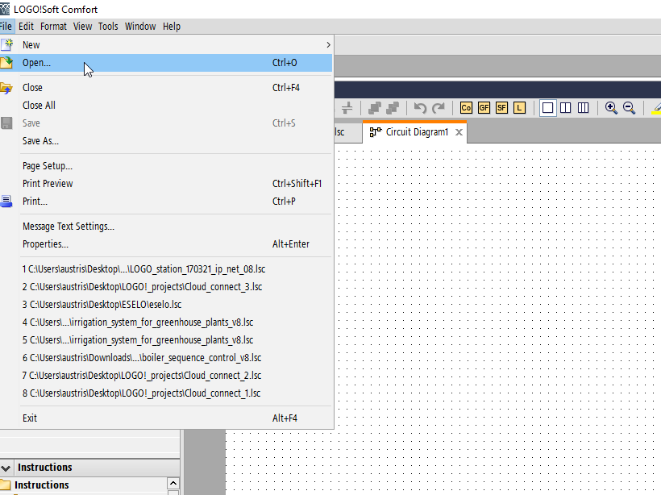
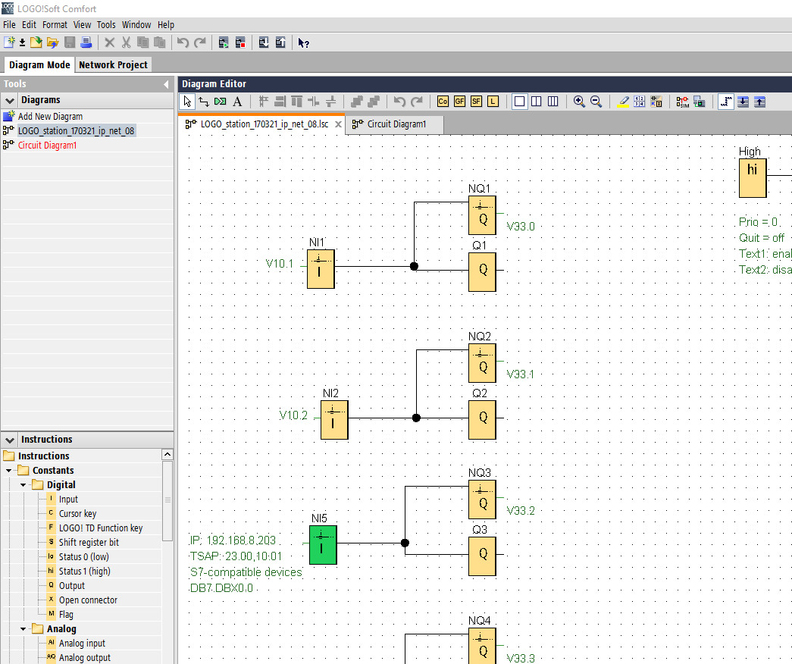
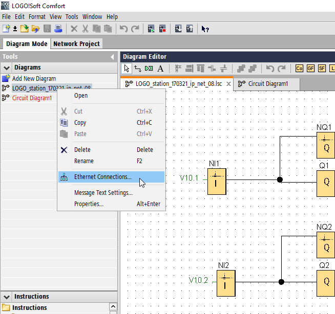
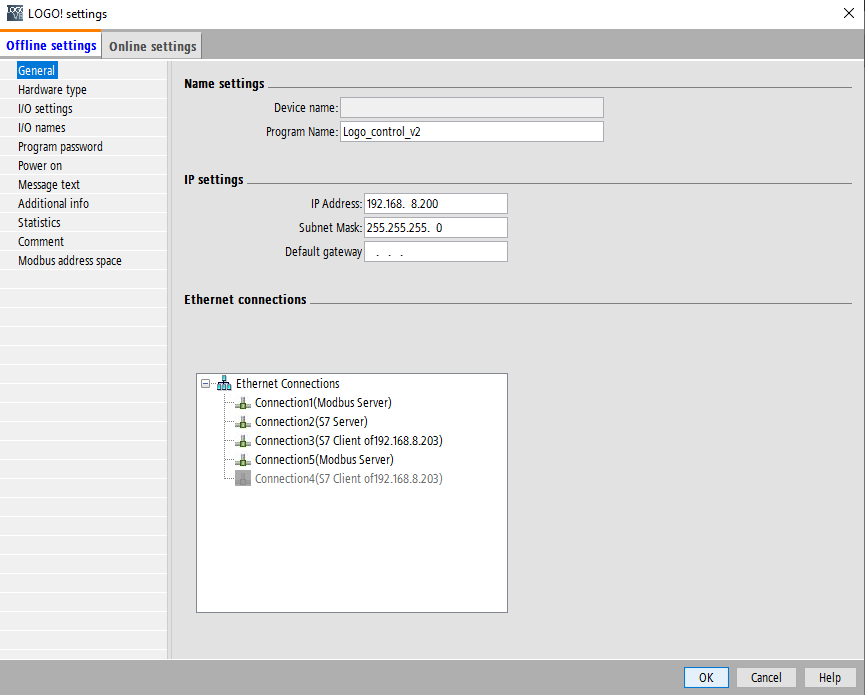
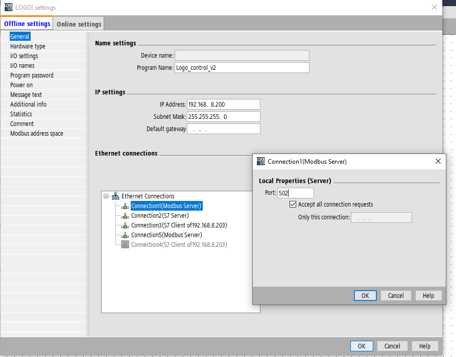
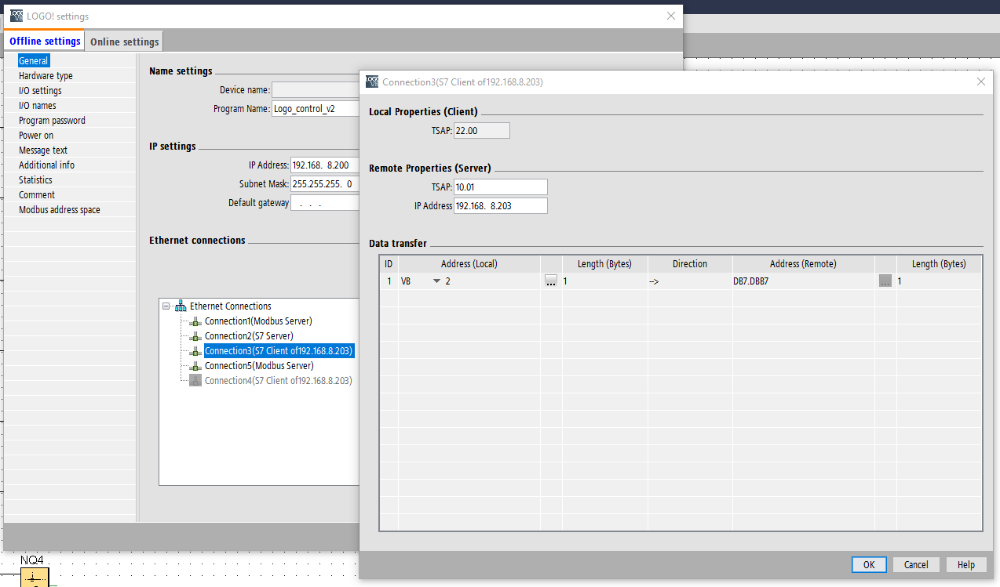
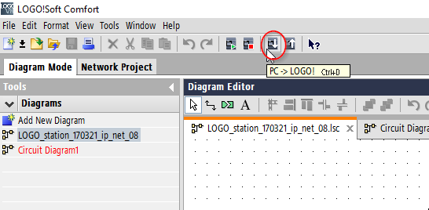
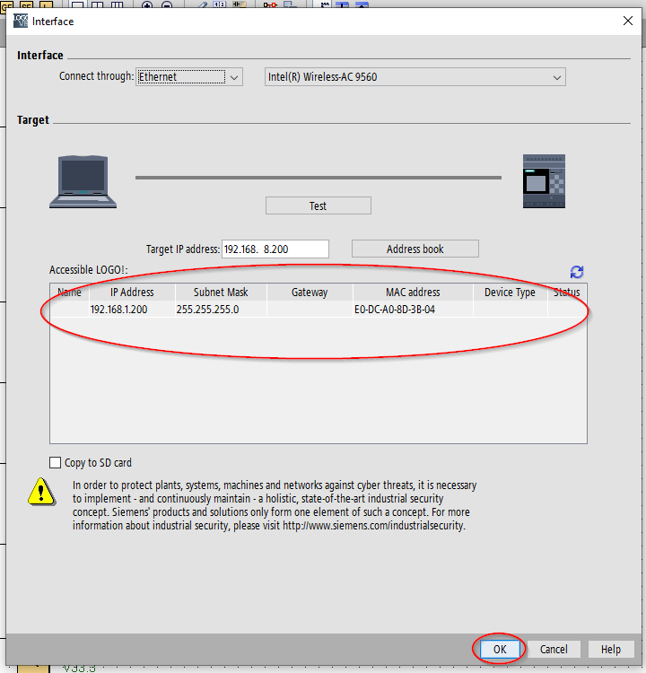

# Unloading configuration to PLC (LOGO!)

This software is installed as any typical application on windows machine. Nothing specific to tell here

Following are steps on how to upland configuration to LOGO!

Download https://github.com/soslweehl/frostyICS/tree/main/config_files/logo! and open in following way

Modifying IP address of target LOGO! if it is necessary:

If IP is changed Modbus and S7 partner devices need to be updated:

S7 configuration:

Uploading project to the  PLC:

Before uploading Soft Comfort will ask to search for device and choose to which of available devices to upload the project:

When project is downloaded to device you can see LOGO parameters on LOGO display and do some simple adjustments.

To debug the program if any changes are made can be done using built in tools. Online test allows to connect to PLC and check the status of program in the PLC

