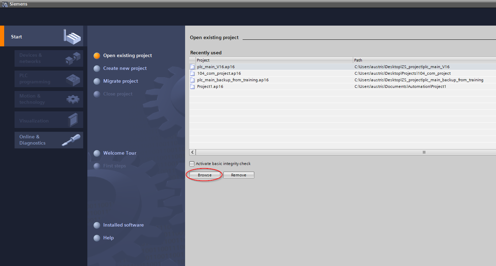
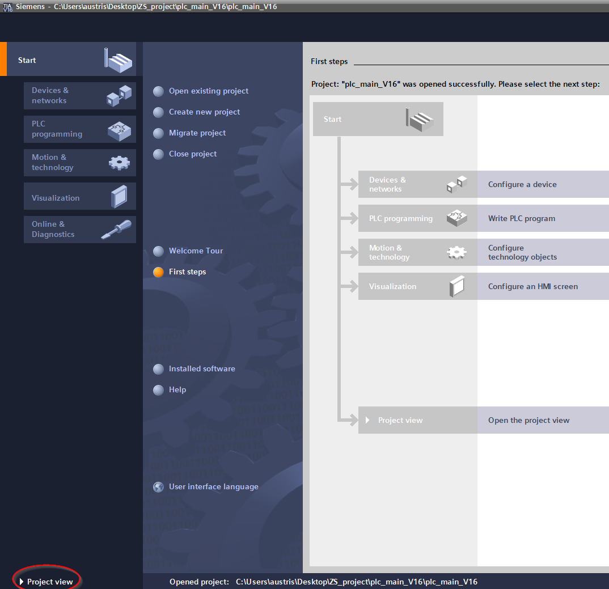
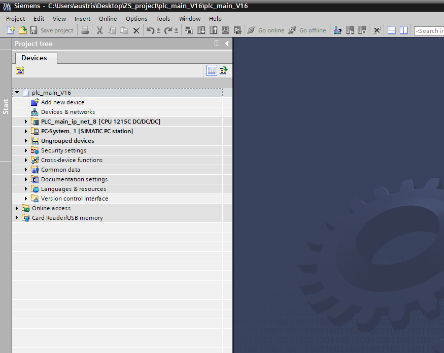
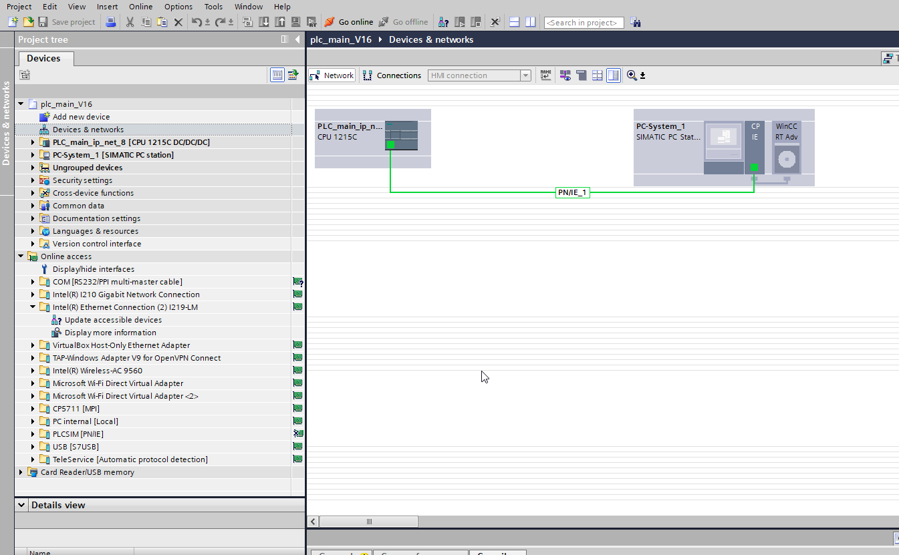
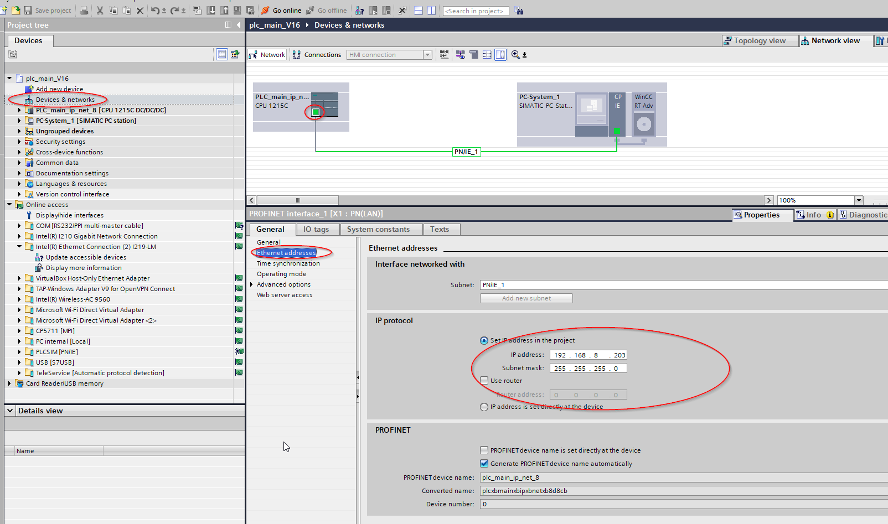
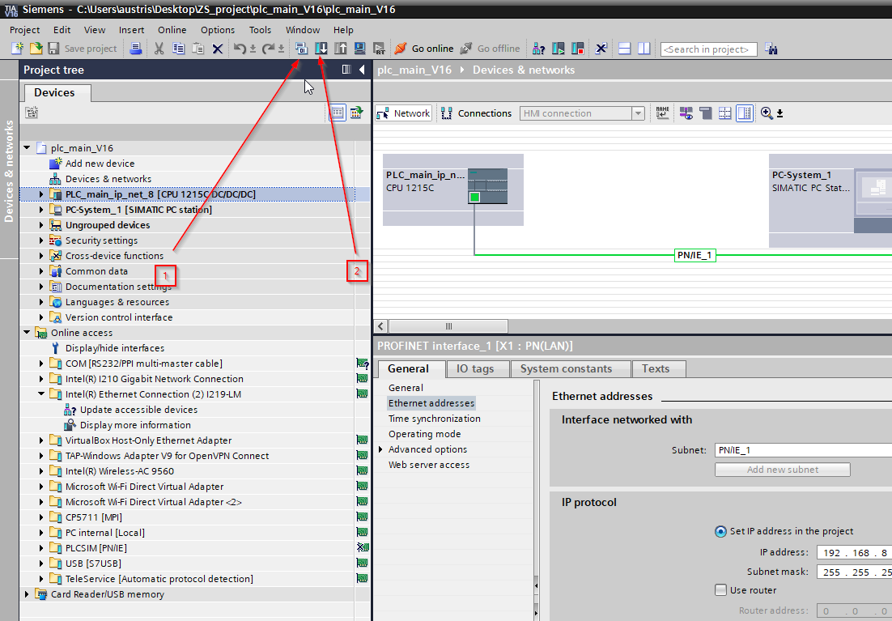
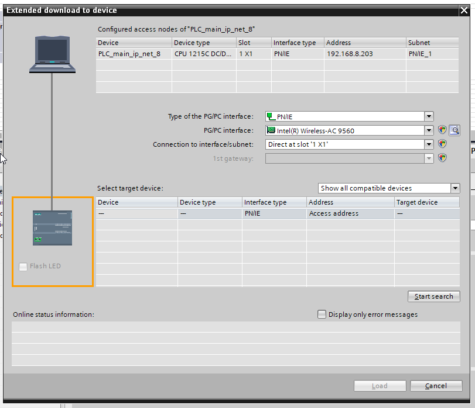

# Uploading project to S7-1200

Download project of S7-1200 and Wincc - https://github.com/soslweehl/frostyICS/tree/main/config_files/S7-1200%20and%20wincc

Before uploading compile to see if there is no errors. then download to PLC

Chose interface and search for available and compatible devices in network. When search completes select the device and upload the project.

