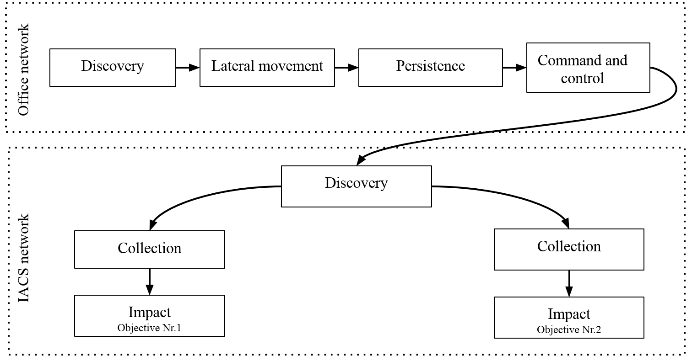

# Exercise scenario

## Overview

FrostyICS was used to conduct training. Following is general structure of the training and the attack path to obtain two objectives.

The initial state of the scenario is shown in figure bellow. In this scenario enterprise network is divided into two segments. One is the office network, where the attacker has gained initial access and has established a command and control channel. In this case office network does not contain any devices as it is out of scope for this exercise and is not required to complete attacks in the IACS network. The displayed structure has informative nature for participants to facilitate the overall idea of the scenario. Therefore, only the IACS network contains actual devices.

Adversary attacks usually consist of multiple steps to achieve the objectives. Each of these steps includes TTPs are adversary behavior where tactics are high-level procedures and techniques are specific actions the attacker makes in the context of the specific technique. The chain of these steps is called the kill chain. In other words, the cyberattack kill chain is steps that trace stages of a cyberattack from the initial reconnaissance stage to the final actions. The author has found three different kill chain approaches -  Kill Chain, ICS kill chain, and MITRE ATT\&CK TTPs knowledge base. It worth mentioning that the cyber kill chain is a concept used for defense to understand and predict attacker TTPs. For this research purposes kill chain is not used for defense but for attack scenario structure development.

## Objectives

In this scenario, the participant plays as the red team and has two main objectives, which can be achieved by any tools possible, but mainly self-created Python scripts are encouraged:

- Switch off warehouse lights and alarm, and prevent system recovery;
- Damage heating plant and prevent system recovery.

## Scenario

Based on MITRE ATT\&CK TTPs knowledge base participants should take following steps to achieve objectives:

- Tactics in office network:
  - Discovery - looking for available devices in the office network;
  - Lateral movement - attacker spreading to other devices;
  - Persistence - attacker gains stable access network devices to gains access to IACS network;
  - Command and control - attacker uses techniques to establish communication with the compromised system.
- Tactics in IACS network:
  - Discovery - Looking for available devices in the IACS network, discovering open ports, and discovering IACS processes controlled by the IACS network;
  - Collection - Extracting detailed information about IACS elements and their purpose;
  - Impact - actions on objectives.

Visualized attack scenario

Detailed participant movement to IACS network are described in more detail here - https://github.com/austrisu/master_thesis

## Objective Nr.1 - warehouse attack

To achieve first objective attacker performs Modbus attack on LOGO 8.2

To perform control manipulation, the attacker uses information gathered from the collection phase. For the attacker to switch off the lights and alarms, he needs to control a specific LOGO! 8.2 variables V10.1 and V10.2. Derived from LOGO! 8.2 user documentation are Modbus address mapping . Using this information attacker sends Modbus commands, changing the state of addresses 82 and 83 from true to false. Created Modbus frame is encapsulated in TCP/IP packet and sent to the destination. Python script example created by the author for this scenario can be seen in https://github.com/austrisu/ICS_poc

## Objective Nr.2 - heat plant attack

During the impact stage, the attacker tries to manipulate, disrupt or impair IACS systems and controlled physical processes. The main vulnerabilities of S7-1200 are bound to the S7comm protocol. For the attacker to exploit protocol vulnerabilities, he needs to understand the program structure gathered during collection phase. 

From the downloaded S7-1200 program, the attacker can determine what tags are responsible for specific physical function control. These tags are shown in table bellow. Each tag name has assigned the data block number and memory offset within that data block. These are the parameters necessary to send the S7comm control request to the PLC.

| Tag name             | Data type | Memory offset | Data block |
| -------------------- | --------- | ------------- | ---------- |
| temperature_setpoint | int       | 0.0           | DB6        |
| max_presure          | int       | 2.0           | DB6        |
| pump_speed           | int       | 0.0           | DB9        |
| valve_state          | int       | 2.0           | DB9        |

The attacker can send crafted S7comm requests to PLC using Python script with S7comm library called Snap7. Before using the Snap7 library, it should be compiled from the source, and the high-level Python wrapper can use the Snap7 library. Python script example created by the author for this scenario can be seen in https://github.com/austrisu/ICS_poc